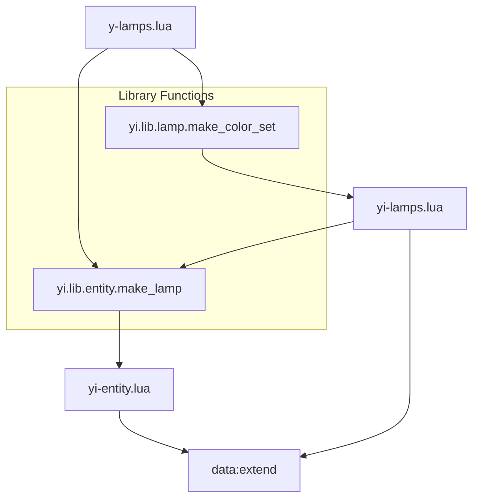

# y-lamps.lua Optimization Plan

## Summary

Review of [`prototypes/objects/y-lamps.lua`](prototypes/objects/y-lamps.lua) reveals significant code duplication that can be eliminated using new yi library functions. The file defines 8 lamps with repeated patterns across item/recipe/entity definitions.

## Current Issues

### 1. Major Duplication: Colored Lamps

The four colored lamps (y_lamp_red, y_lamp_green, y_lamp_blue, y_lamp_yellow) are nearly identical except for name and graphics paths:

```lua
-- y_lamp_red, y_lamp_green, y_lamp_blue, y_lamp_yellow ALL share:
energy_source = { type = "electric", usage_priority = "secondary-input" }
energy_usage_per_tick = "5kW"
light = { intensity = 0.25, size = 8 }
max_health = 75
collision_box = { { -0.1, -0.1 }, { 0.1, 0.1 } }
selection_box = { { -0.5, -0.5 }, { 0.5, 0.5 } }
circuit_wire_max_distance = 22.5
-- Same picture dimensions and shifts
```

### 2. Moderate Duplication: Entity Structure

All lamp entities share common patterns:
- `flags = { "placeable-neutral", "player-creation" }`
- `corpse = "small-remnants"` (or "big-remnants" for monument)
- `icon_size = 64`
- Standard minable structure

### 3. Unused Local Variables

Lines 1-3 define locals that are never used:
```lua
local common_lamp = { energy_source = { type = "electric", usage_priority = "secondary-input" }, energy_usage_per_tick = "5kW", light = { intensity = 0.25, size = 8 }, circuit_wire_max_distance = 22.5 }
local default_light = { intensity = 0.25, size = 8 }
local default_energy = "5kW"
```

## Proposed Solution

### New Library Functions

#### 1. `yi.lib.entity.make_lamp(name, config)` in yi-entity.lua

Follow the existing [`yi.lib.entity.make_pipe()`](lib/yi-entity.lua:346) pattern:

```lua
function yi.lib.entity.make_lamp(name, config)
	config = config or {}
	
	local defaults = {
		icon_size = 64,
		health = 50,
		corpse = "small-remnants",
		flags = { "placeable-neutral", "player-creation" },
		collision_box = { { -0.1, -0.1 }, { 0.1, 0.1 } },
		selection_box = { { -0.5, -0.5 }, { 0.5, 0.5 } },
		energy_source = { type = "electric", usage_priority = "secondary-input" },
		energy_usage_per_tick = "5kW",
		light = { intensity = 0.8, size = 40 },
		circuit_wire_max_distance = 14.5,
	}
	
	-- Merge and return entity definition
end
```

#### 2. `yi.lib.lamp.make_color_set(colors, base_config)` in yi-lamps.lua

Generate complete item/recipe/entity sets for colored lamps:

```lua
function yi.lib.lamp.make_color_set(colors, base_config)
	-- colors = { {name="red", color={r=0.7,g=0,b=0}}, ... }
	-- Returns array of prototypes for data:extend
end
```

### Architecture Diagram



## Implementation Steps

### Step 1: Add `make_lamp()` to yi-entity.lua

Create the base lamp entity generator following the `make_pipe()` pattern:
- Accept name and config table
- Define sensible defaults for lamp entities
- Handle picture_off/picture_on sprites
- Support all lamp-specific properties (light, energy_usage_per_tick, etc.)

### Step 2: Implement yi-lamps.lua

Replace the placeholder with actual implementation:
- `yi.lib.lamp.make_item(name, config)` - Generate lamp item prototype
- `yi.lib.lamp.make_recipe(name, config)` - Generate lamp recipe prototype  
- `yi.lib.lamp.make_color_set(colors, base_config)` - Batch create colored lamps

### Step 3: Update yi-tools.lua

Add require statement for yi-lamps.lua in the correct load order.

### Step 4: Refactor y-lamps.lua

Convert from verbose inline definitions to library calls:

**Before (497 lines):**
```lua
data:extend({
    { type = "item", name = "y_lamp_red", ... },
    { type = "recipe", name = "y_lamp_red", ... },
    { type = "lamp", name = "y_lamp_red", ... },
    { type = "item", name = "y_lamp_green", ... },
    -- ... repeated for each lamp
})
```

**After (estimated ~100 lines):**
```lua
-- Unique lamps using make_lamp()
data:extend({
    yi.lib.entity.make_lamp("y-tinylamp", {
        icon = "__Yuoki__/graphics/icons/lamp-1-icon.png",
        energy_usage_per_tick = "4kW",
        light = { intensity = 0.8, size = 60, color = { r = 1.0, g = 0.95, b = 0.8 } },
        picture_off = { ... },
        picture_on = { ... },
    }),
    -- ... other unique lamps
})

-- Colored lamp set using make_color_set
data:extend(yi.lib.lamp.make_color_set({
    { name = "red", color = { r = 0.7, g = 0.0, b = 0.0 } },
    { name = "green", color = { r = 0.0, g = 0.7, b = 0.0 } },
    { name = "blue", color = { r = 0.0, g = 0.6, b = 0.7 } },
    { name = "yellow", color = { r = 0.7, g = 0.7, b = 0.0 } },
}, {
    energy_usage_per_tick = "5kW",
    light = { intensity = 0.25, size = 8 },
    ingredients = { { type = "item", name = "y_structure_element", amount = 1 }, { type = "item", name = "y-chip-1", amount = 1 } },
}))
```

## Benefits

| Metric | Before | After |
|--------|--------|-------|
| Lines of code | 497 | ~100-150 |
| Duplicate entity patterns | 8 | 0 |
| Duplicate colored lamp definitions | 4 full sets | 1 function call |
| Maintenance burden | High | Low |

## Files Modified

1. [`lib/yi-entity.lua`](lib/yi-entity.lua) - Add `make_lamp()` function
2. [`lib/yi-lamps.lua`](lib/yi-lamps.lua) - Implement helper functions
3. [`lib/yi-tools.lua`](lib/yi-tools.lua) - Add yi-lamps require
4. [`prototypes/objects/y-lamps.lua`](prototypes/objects/y-lamps.lua) - Refactor to use library

## Testing

After implementation, verify by:
1. Launching Factorio with the mod
2. Checking that all 8 lamps appear in the crafting menu
3. Placing each lamp type to verify sprites and lighting
4. Confirming no data stage errors with `--check-unused-prototypes`
